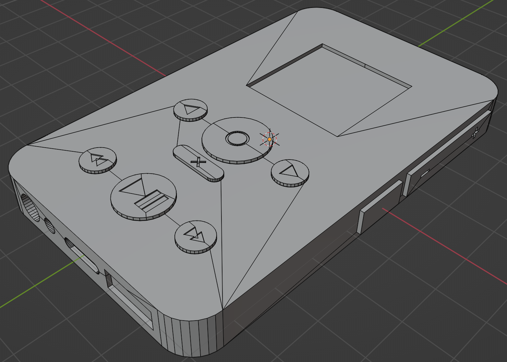

# Music Box

## Problem and Design Overview

The problem we set out to address was a lack of understanding on the part of music recommendation algorithms. They assume each person has just one music taste, but from our research there are many more factors that determine the types of music people like to listen to, as well as why they listen to it. People’s music taste is highly dependent on what they are doing and how they are feeling, as well as the general “mood” of the environment they’re in. For example, my recommender (Spotify) always eventually begins recommending lo-fi because I listen to hours of it everyday, but I don’t always want to listen to lo-fi.

Our solution was to design a system that stored several recommendation algorithms for each person, called “Personas”. Each persona would observe the music one likes to listen to when performing certain tasks, like driving, working out, or relaxing, and provide appropriate song recommendations that gradually become more accurate to each persona as time goes on. We find this additional input by the listener to be important in recommending songs that they actually want to hear.

## Design Research Process and Key Insights:

### Design Research Process

The goals of our research were mainly two-fold. First we needed to understand how listeners were currently finding new music. This would help us tailor our design for the ways that heavy listeners already find music. Secondly, we wanted to figure out if people were happy with the recommendations they were getting from music apps. We as a team thought the recommendations were sub-pair, but we needed to know if this was a common problem.

We conducted our design research primarily through interviewing participants and secondarily through a contextual analysis of their process of choosing and listening to music.

Our design research had three primary participants:

 - Luke; Once a member of his high school’s jazz band, he now plays the banjo and guitar. Luke's musical tastes are nebulous and rather irregular, making it somewhat difficult for him to describe. Hence we’ve determined him to be a primary case study for the problem we are trying to solve. He primarily listens to music via Apple Music while cooking and doing other regular tasks around the home.
 - Randy; A member of many of his high school bands, having even started one of his own, and now an electronic dance musician. He very often uses Spotify to listen to music while carrying out many different tasks in his day-to-day life. He listens via a smart speaker most of the time. Randy’s relationship to music is very personal and his tastes are very diverse, so we believe he is a perfect case study to explore our problem.
 - Kevin; A vinyl record collector, indie rock enthusiast, and heavy listener. Kevin uses Spotify and their vinyl records to listen to music. They use corded headphones a majority of the time, but on occasion will use a stationary Bluetooth speaker to share music. While their musical tastes are very diverse, Kevin focuses on rock-adjacent artists when they listen. Kevin’s dedication to listening to music makes them an ideal participant for self tracking but their usage of physical media makes digital tracking somewhat difficult.

These participants were chosen for their enthusiasm with music, frequency of listening, and overall thoughtfulness about their listening habits. We interviewed them to gather a “baseline” musical evaluation for each person. This lets us compare and contrast interview answers between each one. The contextual inquiry was the main portion of our research. The inquiries gave us first hand experience with how heavy listeners navigate the landscape of music.

### 3 Key Insights
- **Myopic Algorithms:** All three of our participants expressed dissatisfaction with current music recommendation systems in applications such as Spotify and Apple Music as they suggest songs to listen to based almost solely off of what users have previously listened to, when they’ve listened to it, and for how long. What we’ve discovered is that current music recommendation programs don’t factor in the social aspects of music listening and discovery, such as setting, mood, and suggestions from other people. For example, Kevin’s interest in indie rock on vinyl records came from numerous listening sessions in music stores in his youth, something that current algorithms are unable to factor in.

- **Social Discovery:** All participants mentioned the importance of family, friends, or influencers in their music discovery process. One participant said “[The genres I like] each have a person in my life that represents them” and another specifically called out several influencers that he discovers new music through. All three participants mentioned a primary way they have of music discovery is asking others what they listen to.

- **Constant Clutter:** Two out of three participants mentioned that there were huge parts of their listening applications that they ignored. “I always ignore that” and “I scroll past this boilerplate nonsense to get to…” are two quotes that set us on to the fact that current commonly-used listening apps and services simply have too many features that go unused.

## Iterative Design Process and Key Insights:

### Iterative Design Process

We chose to focus on creating and sharing personas for our first task. These personas would be chosen by the person using the device and trained via a like and dislike button. Second we chose to focus on a linking process. Linking two personas allows people to listen to songs they both want to hear based on both of their chosen personas.

Our process was to iterate first via a paper prototype. Our first paper prototype was glued and in full 3D to mimic the design of the device. This turned out to be too high a fidelity level for our paper prototype, as it was too difficult to modify as we identified shortcomings in our design. We then shifted to a simpler 2D paper prototype after inspection revealed some shortcomings in our initial prototype. This 2D version was the prototype we used for usability testing. After several iterations of inspection and usability testing we moved to a digital mock-up via Adobe Illustrator.

### 3 Key Insights

- **Simplifying Button Layout:** Our initial prototype was designed for all actions to be performed by pressing physical buttons on the body of the device. This resulted in us having a lot of buttons that we had to place somewhere on the design. During heuristic analysis it was noted that less commonly used controls related to connecting devices were placed prominently on the front of the design while actual media control buttons were on the side of the device despite being central to the devices primary purpose. After this we rearranged all the controls, removing some unnecessary ones, to more prominently display the controls that were most useful on the front face of the device.

	 
- **Making Menus Navigable:** Our initial completely physical button interaction method had other issues as well. One of these issues was that as the buttons were always available to be pressed even in states where they had no function we needed robust error handling states to communicate with a user why the button had no function in this instance. This was noted in heuristic analysis as a violation of the “Error Handling” heuristic. Another issue with this design looked very cluttered to the students who were inspecting it and they did not find the uses of the different buttons clear. We fixed both of these issues by removing several buttons and moving that functionality into a scrollable menu that showed up on the screen when the persona was selected. This meant that we could simply not show these option when they were not available, and that testers were not overloaded with too many options all at once.

	 
- **Tweaking Iconography:** Even with a menu added, we discovered that our testing participants didn’t realize that it was indeed a scrollable menu they were looking at; furthermore, several participants called the “select” button the “share” button as “Share had been the first option presented when they pushed it. We attempted to remedy this situation by adding arrows to the menu icons and then increasing their size both on-screen and on the physical buttons of the device.

	 

## Resulting Design

 

3D and physical mockups of the final design.

The final design rendered in adobe illustrator. The screens on the right are all of the menu and persona screens someone might encounter on the device.

### Task 1: Listening to Music with Others

Here we start with two speakers listening to different personas, but already connected (not shown).

Next we click the select button on one of the speakers to open the menu for the current persona.

Next we scroll to the link option.

When we hit the select button on the link option we enter a requesting link mode. The connected speaker gets a link request.

Now after hitting select on the connected speaker, the two personas are linked.

We hit play on either of the devices to play both.

We can hit select on either device to have the option to save the merged persona.

## Task 2. Share algorithm and listen to it

 

A single device listens to a driving persona and trains it via the like and dislike buttons to play music that they enjoy in this circumstance. When a like or dislike button is pressed a thumbs up or thumbs down flashes on the screen.

A second person expresses interest in copying the persona, so the first device selects the persona. The first option shown is share because the two devices are paired (not shown).

Now that the persona has been shared it appears in the other device’s list of persona, but with the external persona indicator in the top right.

The second device is free to play the persona as long as they are connected to the other device.

The second device is also free to save the persona by selecting the persona and selecting save. This allows them to continue using it and to modify it to better suit their own tastes by liking or disliking songs.
